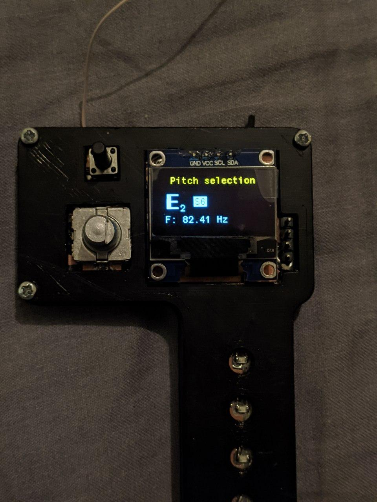
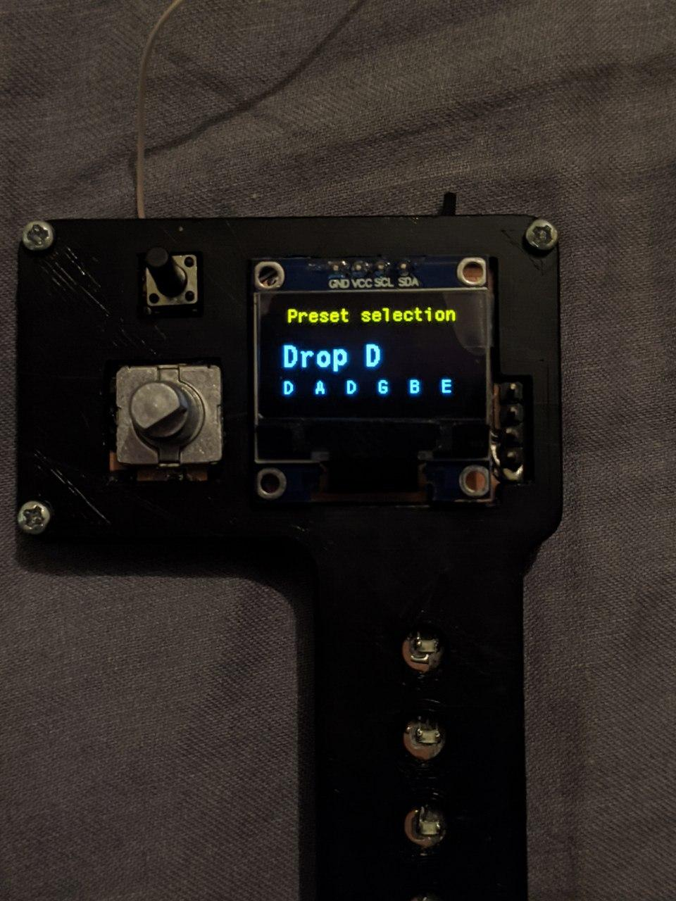
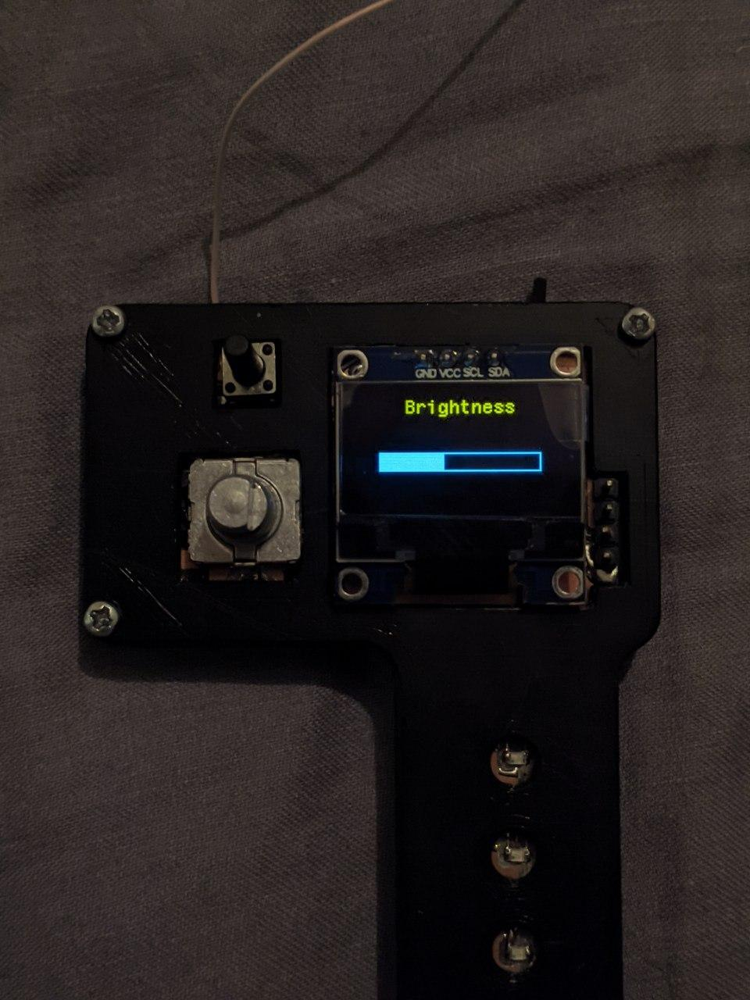

# Optical Guitar Tuner

Guitar tuner, which uses stroboscopic effect instead of sound.

## Modes

- Pitch selection (Default) - change pitch of individual strings.
- Brightness - change brightness of the LEDs.
- Preset selection - select tunings from premade presets.

## Controls

- Hold down the encoder to change the mode.

Pitch selection:

- Press the encoder to change the active LED.
- Rotate the encoder to change the frequency of the active LED.

Other modes:

- Press or rotate the encoder to change the setting.

## Interface

## Components

* Li-Po 380mAh 3.7V
* OLED display 0.96" I2C 128x64
* eBoot Mini MP1584EN DC-DC Buck Converter Adjustable Power Supply Module
* TP4056 TYPE-C

## PCB

[PCB repository](https://github.com/MykhailoSobko/OTunerPCB)

## Contributors

[Mykhailo Bondarenko](https://github.com/mykhailo-bondarenko-ucu)

[Mykhailo-Taras Sobko](https://github.com/MykhailoSobko)

[Bohdan Ruban](https://github.com/iamthewalrus67)